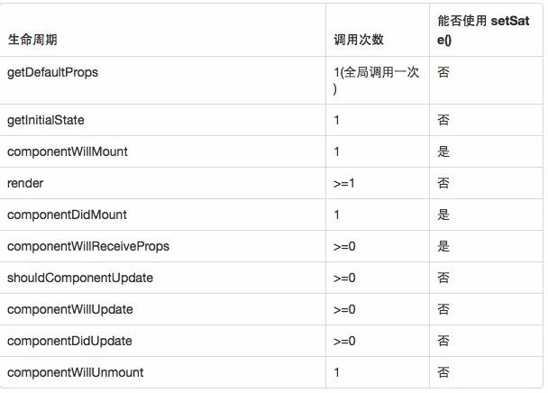

## 项目介绍
笔者正在学习react native，该项目主要是笔者的学习记录。该项目的重点在react native内
整合redux。有此需求的同学，请着重关注redux目录和/src/components/button/CountButton.js
文件。

## `React Native`生命周期

### 实例化阶段函数功能分析
#### getDefaultProps方法
利用this.props获取在这里初始化它的属性，并且组件初始化之后，再次使用该组件不会调用
getDefaultProps方法，所以组件自己不可以修改props，只可由其他组件调用它时在外部进行
修改。
#### getInitialState方法
用于对组件组件的一些状态进行初始化，在以后的过程中，会再次调用，所以可以将控制控件
状态的一些变量放在这里进行初始化
**一旦调用了this.setState方法，组件就一定会调用render方法，对组件进行再次渲染，不
过，React框架会根据DOM的状态自动判断是否需要真正渲染**
#### componentWillMount方法
组件将要被加载到视图之前调用
#### componentDidMount方法
在调用了render方法，组件加载成功并成功渲染出来之后，所要执行的后续操作，一般都会在
这个方法中进行，比如经常要面对的网络请求等加载数据操作
**因为UI已经成功渲染，而且这里面是异步的，所以放在这个方法进行数据请求等复杂的操作，
不会出现UI错误**

### 存在阶段函数功能分析
#### shouldComponentUpdate方法
一般用于优化，可以返回false或者true来控制是否进行渲染
#### componentWillUpdate方法
组件刷新之后调用
#### componentDidUpdate方法
组件更新后调用

### 销毁阶段函数功能分析
#### componentWillUnmount
用于清理一些无用的内容，比如定时器清除等

